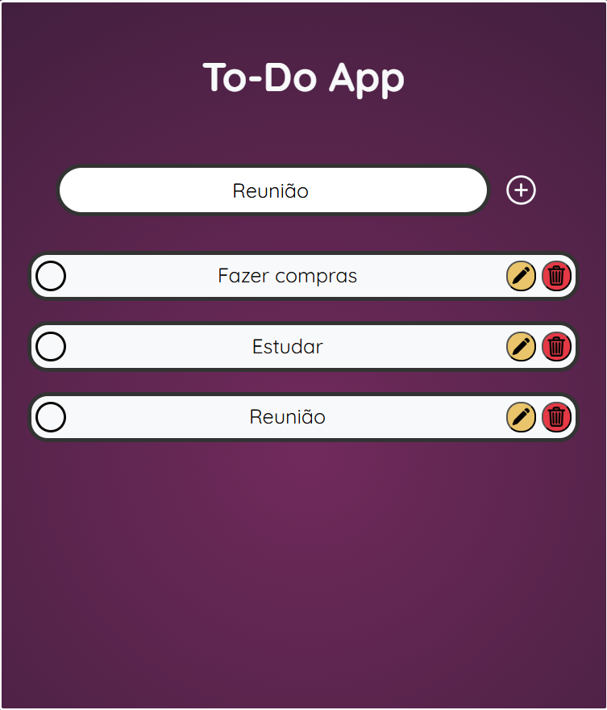

# 📝 Responsive To Do List

Aplicação de lista de tarefas responsiva e instalável como app (PWA), construída com HTML, CSS e JavaScript vanilla.

🔗 **[Ver o projeto no ar](https://vinicius-novais.github.io/Responsive_ToDoList/)**



## ✨ Funcionalidades

- Adicionar, editar, concluir e remover tarefas
- Edição inline: clique no lápis, altere o texto e confirme com Enter (ou clicando fora)
- 🎉 Confete ao concluir uma tarefa
- Tarefas salvas no navegador com localStorage — feche e abra que elas continuam lá
- Layout responsivo para celular, tablet e desktop
- Fonte do campo de texto se ajusta automaticamente em telas pequenas
- Instalável como aplicativo (PWA) e funciona offline após o primeiro acesso

## 🛠️ Tecnologias

- **HTML5** — estrutura semântica
- **CSS3** — responsividade com media queries, variáveis CSS e checkbox customizado
- **JavaScript** — manipulação do DOM, delegação de eventos e localStorage
- **PWA** — Web App Manifest + Service Worker com cache versionado
- **canvas-confetti** — efeito de confete ao concluir tarefas
- **Google Fonts** — fonte Quicksand

## 🚀 Como rodar localmente

```bash
# Clone o repositório
git clone https://github.com/Vinicius-Novais/Responsive_ToDoList.git

# Entre na pasta
cd Responsive_ToDoList
```

Depois é só abrir o `index.html` no navegador.

> **Nota:** para testar os recursos de PWA (instalação e offline), é preciso servir o projeto via HTTP. Uma opção simples é a extensão **Live Server** do VS Code.

## 📱 Instalando como app

Acesse o site publicado pelo celular ou desktop e o navegador vai oferecer a opção de instalar o app (ícone de instalação na barra de endereço ou "Adicionar à tela inicial").

## 📚 O que aprendi

- Delegação de eventos para lidar com elementos criados dinamicamente
- Persistência de dados com localStorage (salvar, carregar e sincronizar edições)
- Como transformar um site em PWA: manifest, service worker e estratégia de cache
- Responsividade com media queries e ajustes de UX para mobile

## 👤 Autor

**Vinícius Novais**

- GitHub: [@Vinicius-Novais](https://github.com/Vinicius-Novais)
